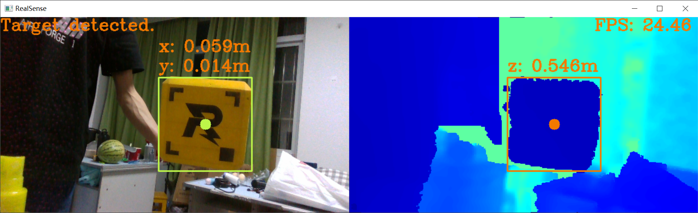

武汉科技大学崇实战队工程采矿单项赛开源代码

---------

# 总体框架

崇实战队工程采矿单项赛的软件部分主要由底层控制代码与上层视觉算法构成。机载运算平台manifold2运行视觉部分的代码，通过D435i深度相机精确定位矿石，并将相关控制指令通过USB线传递至C板。C板主要运行控制部分的代码，通过USB虚拟串口与manifold2通讯，并控制底盘与取矿机构的电机与电磁阀。整体的硬件框图如下：


# manifold2部分

在工程采矿单项赛中，利用视觉对矿石进行辅助对位能有效减少操作手的失误率，节省对位时间。manifold2主要负责矿石的定位与对准，需要Ubuntu与ROS作为运行环境基础。

代码主要由三个功能包构成：`wust_base`功能包负责与C板通讯，发送控制指令，`wust_auto_align`功能包负责矿石的识别与定位，依赖OpenCV与Realsense sdk，`wust_bringup`功能包负责启动所有功能包。

## 矿石定位代码说明

首先利用D435i相机的深度信息进行图像的分割，去除背景的干扰信息

```python
# 从相机捕获帧并进行对齐
frames = pipeline.wait_for_frames()
frames = align.process(frames)
depth_frame = frames.get_depth_frame()
color_frame = frames.get_color_frame()
if not depth_frame or not color_frame:
    continue

# 对深度图进行滤波处理
depth_frame = post_process_depth_frame(depth_frame)

# 把数据转化为numpy数组
depth_image = np.asanyarray(depth_frame.get_data())
color_image = np.asanyarray(color_frame.get_data())

# 去除背景
grey_color = 153
depth_image_3d = np.dstack((depth_image, depth_image, depth_image))
remove_background_image = np.where((depth_image_3d > clipping_distance) | (depth_image_3d <= 0), grey_color, color_image)
```

效果如下（背景用灰色进行了填充）：


矿石的识别主要利用了矿石本身的颜色

```python
def find_ore(color_image):
    # 高斯滤波
    cv2.GaussianBlur(color_image, (5, 5), 3, dst=color_image)
    # 把BGR通道转化为HSV色彩空间
    hsv_image = cv2.cvtColor(color_image, cv2.COLOR_BGR2HSV)
    # 识别矿石的颜色特征
    ore_image = cv2.inRange(hsv_image, thresh_low, thresh_high)
    # 对识别后的图像进行腐蚀与膨胀，消除较小的连通域
    kernal = cv2.getStructuringElement(0, (3, 3))
    cv2.erode(ore_image, kernal, dst=ore_image)
    cv2.dilate(ore_image, kernal, dst=ore_image)
	# 轮廓识别
    contours, hierarchy = cv2.findContours(ore_image, cv2.RETR_TREE, cv2.CHAIN_APPROX_SIMPLE)
    if len(contours) > 0:
        # 计算所有轮廓的面积
        area_size = list(map(cv2.contourArea, contours))
        # 取最大面积
        max_size = max(area_size)
        max_area_index = area_size.index(max_size)
        # 若面积在阈值范围内，则认为识别到了矿石
        if min_area_size < max_size < max_area_size:
            box = cv2.boundingRect(contours[max_area_index])
            return box
    return None
```

效果如下：


矿石的定位利用了深度相机的内参

```python
depth = depth_frame.get_distance(center_x, center_y)
depth_point = rs.rs2_deproject_pixel_to_point(depth_intrin, [center_x, center_y], depth)
```

矿石的定位效果如下：



定位到了矿石后，进一步利用PD控制器移动机器人，让机器人的夹爪对准矿石

```python
# 计算误差
error = offset_x - center_x

# 发布速度控制指令
vel_msg.linear.x = forward_velocity
vel_msg.linear.y = limit_speed(kp * error + kd * (error - last_error))
vel_msg.angular.z = 0
vel_publisher.publish(vel_msg)

# 更新误差
last_error = error
```

## 使用指南

### 1. 配置STM32的USB虚拟串口映射规则

首先连接STM32设备的虚拟串口，lsusb可以查看Vendor和Product的ID，然后创建并配置/etc/udev/rules.d/roborts.rules文件

```
KERNEL=="ttyACM*", ATTRS{idVendor}=="0483", ATTRS{idProduct}=="5740", MODE:="0777", SYMLINK+="serial_sdk"
```
重启udev服务
```shell
sudo service udev reload
sudo service udev restart
```
可能还需要重新插拔设备

### 2. 编译librealsense
```shell
cmake .. -DBUILD_EXAMPLES=true -DCMAKE_BUILD_TYPE=release -DFORCE_RSUSB_BACKEND=true -DBUILD_WITH_CUDA=false -DBUILD_PYTHON_BINDINGS:bool=true -DPYTHON_EXECUTABLE=/home/dji/miniforge3/bin/python3.8
make -j$(($(nproc)-1))
sudo make install
```

### 3. 编译功能包并添加开机自启动

```bash
catkin_make
```

把`start.sh`添加到开机启动项中

# C板部分

## 文件目录结构&文件用途说明

| 文件夹 | 来源 | 内容 |
| ---- | ---- | ----  |
| Core | CubeMX | 包含核心代码，外设初始化，系统初始化等 |
| Drivers | CubeMX | CMSIS相关库、STM32 HAL |
| MDK-ARM | CubeMX | Keil uversion 项目相关文件 |
| Middlewares | 开发者 / CubeMX | 中间件 |
| application |  开发者 | 手动编写的代码 |
| bsp | 开发者 | 板级支持包 |
| components | 开发者 | 包含用到的算法，驱动 |
| Inc,Src | CubeMx | 头文件与源文件 |
C板部分利用了串级PID实现了任意数量电机的位置控制，并基于位置环实现了多电机异步高速高精度加减速运动控制。在代码中实现了对电机的分组管理，有利于电机数目的增添和程序的维护。


## 电机位置控制原理及代码说明


​																								电机控制原理图

电机位置控制的主要代码位于`motor_position_task.c/h`中，主要API如下所示：

```c
/**
  * @brief          设置电机的位置
  * @param[in]      group: 电机所属的电机组序号
  * @param[in]      index: 电机的序号
  * @param[in]      position: 电机的位置
  * @retval         none
  */
extern void set_motor_position(int group, int index, int position);

/**
  * @brief          获取电机当前的位置
  * @param[in]      group: 电机所属的电机组序号
  * @param[in]      index: 电机的序号
  * @retval         电机当前的位置
  */
extern int get_motor_position(int group, int index);

/**
  * @brief          让所有电机进入快速设置ID模式(已绑定到C板上的按键KEY,按下KEY即可快速设置电机ID)
  * @retval         none
  */
extern void reset_all_motor_ID(void);

/**
  * @brief          把电机当前的位置设置为电机位置的原点
  * @param[in]      motor: 电机的指针
  * @retval         none
  */
extern void set_motor_zero_position(int group, int index);

/**
  * @brief          使能电机的位置环
  * @param[in]      group: 电机所属的电机组序号
  * @param[in]      index: 电机的序号
  * @retval         none
  */
extern void enable_motor_position_control(int group, int index);

/**
  * @brief          失能电机的位置环
  * @param[in]      group: 电机所属的电机组序号
  * @param[in]      index: 电机的序号
  * @retval         none
  */
extern void disable_motor_position_control(int group, int index);

/**
  * @brief          通过匀加速运动平稳移动电机
  * @param[in]      group: 电机所属的电机组序号
  * @param[in]      index: 电机的序号
  * @param[in]      accel: 加速过程的加速度     (单位: r/s^2)
  * @param[in]      decel: 减速过程的减速度     (单位: r/s^2)
  * @param[in]      max_speed: 电机最大的速度   (单位: r/s)
  * @param[in]      position: 电机目标位置      (单位: 编码器的值)
  * @retval         none
  */
extern void move_to_position_by_acceleration(int group, int index, float accel, float decel, float max_speed, int position);

/**
  * @brief          异步(不阻塞)通过匀加速运动平稳移动电机
  * @param[in]      group: 电机所属的电机组序号
  * @param[in]      index: 电机的序号
  * @param[in]      accel: 加速过程的加速度     (单位: 圈每秒方)
  * @param[in]      decel: 减速过程的减速度     (单位: 圈每秒方)
  * @param[in]      max_speed: 电机最大的速度   (单位: 圈每秒)
  * @param[in]      position: 电机目标位置      (单位: 编码器的值)
  * @retval         none
  */
extern void asyn_move_to_position_by_acceleration(move_args* args);

/**
  * @brief          阻塞，等待电机运动结束
  * @param[in]      move_args: 电机运动参数的指针
  * @retval         none
  */
extern void wait_motor_move_to_position(move_args* args);
```

主要的控制部分的实现原理如下：


​																										电机控制任务

```c
/**
  * @brief          更新反馈数据
  * @param[in]      motor: 电机的指针
  * @retval         none
  */
static void position_feedback_update(Motor* motor)
{
    //获取电机测量数据
    motor->ecd = motor->motor_measure->ecd;
    motor->speed = motor->motor_measure->speed_rpm;
    
    //更新电机位置
    int relative_ecd = motor->ecd - motor->offset_ecd;
    const int half_ecd_range = motor->ecd_range / 2;
    if (relative_ecd > half_ecd_range)
    {
        relative_ecd -= motor->ecd_range;
    }
    else if (relative_ecd < -half_ecd_range)
    {
        relative_ecd += motor->ecd_range;
    }
    motor->current_position += relative_ecd;
    motor->offset_ecd = motor->ecd;
}
/**
  * @brief          计算电机的速度环和位置环
  * @param[in]      motor_group: 电机的指针
  * @retval         none
  */
static void position_control_loop(Motor* motor)
{
    motor->target_speed = PID_calc(&motor->position_pid, motor->current_position, motor->target_position);
    motor->current = PID_calc(&motor->speed_pid, motor->speed, motor->target_speed);
}
```

多电机异步控制代码说明

调用`asyn_move_to_position_by_acceleration()`函数对单个电机进行位置环的加减速控制，`is_finished`成员用来判断电机是否运动完成。

```c
/**
  * @brief          异步(不阻塞)通过匀加速运动平稳移动电机
  * @param[in]      move_args: 电机运动参数的指针
  * @retval         none
  */
void asyn_move_to_position_by_acceleration(move_args* args)
{
    args->is_finished = 0;
    osThreadCreate(osThread(MOVE_MOTOR_THREAD), args);
}

/**
  * @brief          异步移动电机任务
  * @param[in]      argument: 参数
  * @retval         none
  */
void asyn_move_to_position_by_acceleration_task(void const * argument)
{
    move_args *args = (move_args*)argument;
    
    move_to_position_by_acceleration(args->group, args->index, args->accel, args->decel, args->max_speed, args->position);
    
    args->is_finished = 1;
    
    osThreadTerminate(osThreadGetId());
}

```

阻塞等待电机运动结束

```c
/**
  * @brief          阻塞，等待电机运动结束
  * @param[in]      move_args: 电机运动参数的指针
  * @retval         none
  */
void wait_motor_move_to_position(move_args* args)
{
    while (!args->is_finished)
    {
        osDelay(10);
    }
}
```

## 辅助对位模式说明

通过遥控器s[0]通道值开启和关闭辅助对位模式

```c
if (switch_is_mid(chassis_move_mode->chassis_RC->rc.s[CHASSIS_MODE_CHANNEL]))
{
    chassis_behaviour_mode = CHASSIS_NO_FOLLOW_YAW;
}
```


辅助对位模式将遥控器数据与PC通讯数据叠加，并给工程车一个向前的速度，使工程车始终保持贴紧资源岛的状态，模式代码如下：

```c
/**
  * @brief          辅助对位模式
  * @author         RM
  * @param[in]      vx_set前进的速度,正值 前进速度， 负值 后退速度
  * @param[in]      vy_set左右的速度,正值 左移速度， 负值 右移速度
  * @param[in]      wz_set底盘设置的旋转速度,正值 逆时针旋转，负值 顺时针旋转
  * @param[in]      chassis_move_rc_to_vector底盘数据
  * @retval         返回空
  */

static void chassis_support_control(fp32 *vx_set, fp32 *vy_set, fp32 *wz_set, chassis_move_t *chassis_move_rc_to_vector)
{
    if (vx_set == NULL || vy_set == NULL || wz_set == NULL || chassis_move_rc_to_vector == NULL)
    {
        return;
    }

    chassis_rc_to_control_vector(vx_set, vy_set, chassis_move_rc_to_vector);
    *wz_set = -CHASSIS_WZ_RC_SEN * chassis_move_rc_to_vector->chassis_RC->rc.ch[CHASSIS_WZ_CHANNEL];
    
    *vx_set += chassis_move_rc_to_vector->pc_vel->vx;
    *vy_set += chassis_move_rc_to_vector->pc_vel->vy;
    *wz_set += chassis_move_rc_to_vector->pc_vel->vw - 0.05f * chassis_move_rc_to_vector->chassis_RC->mouse.x;
    
    if (chassis_move_rc_to_vector->chassis_RC->key.v & KEY_PRESSED_OFFSET_Q)
    {
        *wz_set = 3;
    }
    else if (chassis_move_rc_to_vector->chassis_RC->key.v & KEY_PRESSED_OFFSET_E)
    {
        *wz_set = -3;
    }
    
}
```

## PC机通讯说明

c板与PC机采用USB虚拟串口进行通讯，为防止数据错误导致工程车失控，采用如下通信协议：

通信协议格式：

| frame_header(5-byte) | cmd_id(2-byte) | data(n-byte) | frame_tail(2-byte,CRC16,整包校验) |
| -------------------- | -------------- | ------------ | --------------------------------- |

frame_header格式：

| SOF    | data_length | seq    | CRC8   |
| ------ | ----------- | ------ | ------ |
| 1-byte | 2-byte      | 1-byte | 1-byte |

帧头详细定义：

| 域          | 偏移位置 | 大小（字节） | 详细描述                     |
| ----------- | -------- | ------------ | ---------------------------- |
| SOF         | 0        | 1            | 数据帧起始字节，固定值为0xA5 |
| data_length | 1        | 2            | 数据帧中data的长度           |
| seq         | 3        | 1            | 包序号                       |
| CRC8        | 4        | 1            | 帧头CRC8校验                 |

